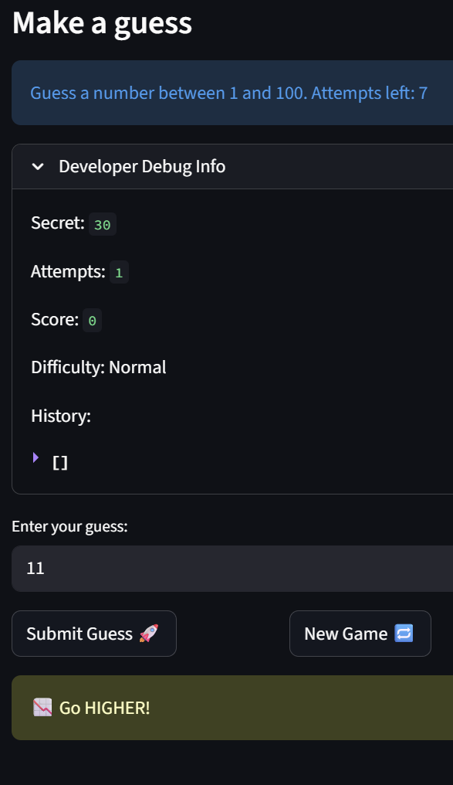

# 🎮 Game Glitch Investigator: The Impossible Guesser

## 🚨 The Situation

You asked an AI to build a simple "Number Guessing Game" using Streamlit.
It wrote the code, ran away, and now the game is unplayable. 

- You can't win.
- The hints lie to you.
- The secret number seems to have commitment issues.

## 🛠️ Setup

1. Install dependencies: `pip install -r requirements.txt`
2. Run the broken app: `python -m streamlit run app.py`

## 🕵️‍♂️ Your Mission

1. **Play the game.** Open the "Developer Debug Info" tab in the app to see the secret number. Try to win.
2. **Find the State Bug.** Why does the secret number change every time you click "Submit"? Ask ChatGPT: *"How do I keep a variable from resetting in Streamlit when I click a button?"*
3. **Fix the Logic.** The hints ("Higher/Lower") are wrong. Fix them.
4. **Refactor & Test.** - Move the logic into `logic_utils.py`.
   - Run `pytest` in your terminal.
   - Keep fixing until all tests pass!

## 📝 Document Your Experience

### Game Purpose
The Impossible Number Guesser is a Streamlit guessing game where the player tries to guess a secret number within a limited number of attempts. The difficulty setting controls the number range and attempt limit. The player receives hints after each guess and earns points based on how few attempts it takes to win.

### Bugs Found

1. **Backward hints** — `check_guess()` in `logic_utils.py` returned "Go HIGHER!" when the guess was too high and "Go LOWER!" when the guess was too low. Expected: hints should guide the player toward the secret number.

2. **Score not resetting on new game** — The new game handler reset attempts, secret, status, and history but not `st.session_state.score`. Expected: score should reset to 0 at the start of each game.

3. **Double-submit required after changing a guess** — `st.text_input` used a difficulty-keyed key (`guess_input_{difficulty}`), so the value wasn't committed to session state before the button click was processed. Expected: a single click should always use the current input value.

4. **Hint disappearing after rerun** — The hint message was stored in a local variable and not persisted to session state, so it was lost on the next rerun. Expected: the hint should remain visible until the next guess is submitted.

5. **Reset button not clearing game status** — Clicking New Game did not reset `st.session_state.status`, so a won or lost game would immediately show the end-game message again. Expected: New Game should fully reset all game state.

### Fixes Applied

- Swapped the hint strings in `check_guess()` so "Too High" returns "Go LOWER!" and "Too Low" returns "Go HIGHER!"
- Added `st.session_state.score = 0` to the new game handler
- Changed `st.text_input` key to `"raw_guess"` and initialized `st.session_state.raw_guess` so the value persists across reruns
- Stored the hint message in `st.session_state.last_message` so it survives reruns
- Added `st.session_state.status = "playing"` to the new game handler
- Refactored `check_guess`, `parse_guess`, `update_score`, and `get_range_for_difficulty` into `logic_utils.py` and added pytest coverage

## 📸 Demo

*Secret is 30, guess is 11 — hint correctly says "Go HIGHER!" confirming the backward hints bug is fixed.*

## 🚀 Stretch Features

- [ ] [If you choose to complete Challenge 4, insert a screenshot of your Enhanced Game UI here]
